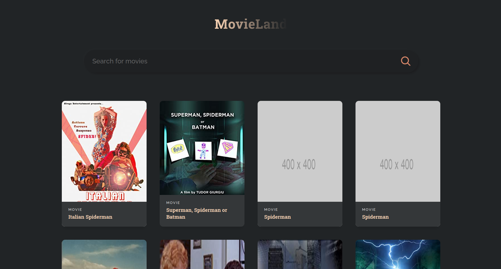

# MovieLand

Here I built a movie application that uses an API to enable different movies to populate due to search terms.  

## Screenshots:



## Built with:

React.JS

## How to use:

```
Download/Extract
cd movie-app
npm install
npm start
```

## Contribute:

Feel free to a fork the repo or notify me of any issues that are present

## Credit:

JavaScript Mastery Tutorial - https://www.youtube.com/watch?v=b9eMGE7QtTk&t=3620s

## License:

MIT © BChainDev
